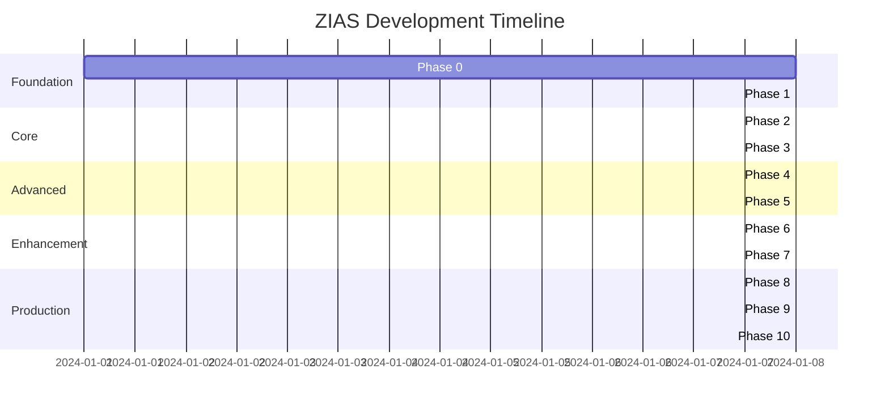

# Zillow Intelligence Acquisition System (ZIAS)
## Comprehensive Development Plan

---

## 🎯 Mission Statement
Transform Zillow data acquisition from a "scraping problem" into an **intelligence operation** with multiple collection vectors, adaptive strategies, and continuous learning capabilities.

---

## Phase 0: Legal & Ethical Foundation [Week 1]
**Priority: MANDATORY**
**Cost: $500-1000**

### 0.1 Compliance Framework
- [ ] Terms of Service legal analysis with attorney consultation
- [ ] Robots.txt compliance configuration
- [ ] Data usage policy documentation (CCPA/GDPR)
- [ ] Rate limiting governance (max 60 requests/minute)
- [ ] Business entity establishment for legitimacy

### 0.2 Official Channel Investigation
- [ ] Research Zillow GetSearchPageState API
- [ ] Investigate Zillow Partnership Program
- [ ] Document Bridge Interactive API options
- [ ] Explore realtor.com data licensing
- [ ] Contact Zillow for legitimate access options

### 0.3 Risk Assessment Documentation
- [ ] Legal risk matrix creation
- [ ] Technical detection risk scoring
- [ ] Financial impact analysis
- [ ] Contingency planning documentation
- [ ] Insurance/legal protection setup

**Success Criteria:** Legal clearance to proceed with technical implementation

---

## Phase 1: Reconnaissance & Intelligence Gathering [Week 2-3]
**Priority: CRITICAL**
**Cost: $100-500**

### 1.1 Network Traffic Analysis
```bash
# Setup monitoring infrastructure
- [ ] Deploy mitmproxy with Zillow certificates
- [ ] Configure Wireshark filters for Zillow traffic
- [ ] Setup HAR file automatic capture
- [ ] Implement Charles Proxy for mobile traffic
- [ ] Create traffic pattern database
```

### 1.2 Endpoint Discovery & Mapping
```typescript
// Document all discovered endpoints
const endpoints = {
  search: [],      // Search-related APIs
  property: [],    // Property detail APIs
  graphql: [],     // GraphQL endpoints
  autocomplete: [], // Suggestion APIs
  map: [],         // Map tile APIs
  mobile: []       // Mobile app APIs
}
```

### 1.3 Authentication Flow Analysis
- [ ] Session token lifecycle mapping
- [ ] Cookie dependency documentation
- [ ] OAuth flow reverse engineering
- [ ] API key discovery and rotation patterns
- [ ] Client ID/Secret extraction methods

### 1.4 JavaScript Challenge Documentation
```javascript
// Identify and document all challenges
challenges = {
  cloudflare: "Challenge page patterns",
  recaptcha: "Implementation details",
  behavioral: "Mouse/scroll tracking",
  fingerprinting: "Canvas, WebGL, Audio",
  timing: "Request interval requirements"
}
```

**Success Criteria:** Complete map of Zillow's technical architecture

---

## Phase 2: Minimal Viable Extractor (MVE) [Week 3-4]
**Priority: HIGH**
**Cost: $50-200**

### 2.1 Basic Request Validation
```typescript
// Find simplest working request
class MinimalExtractor {
  async findMinimalRequest() {
    // Start with browser capture
    // Remove headers one by one
    // Find minimum viable headers
    // Document exact requirements
  }
}
```

### 2.2 Progressive Enhancement Testing
- [ ] Level 0: Direct HTTP request
- [ ] Level 1: Add session management
- [ ] Level 2: Add JavaScript execution
- [ ] Level 3: Add browser automation
- [ ] Level 4: Add anti-detection measures

### 2.3 Data Extraction Pipeline
```python
# Build extraction with fallbacks
extractors = [
  JSONExtractor(),      # Try API response
  GraphQLExtractor(),   # Try GraphQL
  HTMLExtractor(),      # Parse HTML
  VisualExtractor()     # OCR fallback
]
```

### 2.4 Success Metrics Framework
- [ ] Response success rate tracking
- [ ] Data completeness scoring
- [ ] Latency measurement
- [ ] Cost per property calculation
- [ ] Detection rate monitoring

**Success Criteria:** 50% success rate with basic extraction

---

## Phase 3: Intelligent Adaptation Layer [Week 4-6]
**Priority: HIGH**
**Cost: $500-2000**

### 3.1 Machine Learning Detection Predictor
```python
class DetectionPredictor:
    features = [
        'request_rate', 'session_age', 'ip_reputation',
        'header_consistency', 'mouse_entropy', 'timing_pattern'
    ]
    
    def train_model(self):
        # Random Forest for detection prediction
        # Update model with each attempt
        # Predict risk before requests
```

### 3.2 Behavioral Cloning System
- [ ] Chrome extension for user recording
- [ ] Mouse trajectory database creation
- [ ] Scroll pattern analysis
- [ ] Click timing distribution modeling
- [ ] Reading time correlation mapping

### 3.3 A/B Testing Framework
```typescript
interface Experiment {
  name: string;
  variants: Variant[];
  metrics: string[];
  duration: number;
}

// Systematic testing of hypotheses
experiments = [
  userAgentTest,
  timingTest,
  headerCombinationTest,
  proxyTypeTest
]
```

### 3.4 Self-Healing Architecture
- [ ] Automatic strategy switching on failure
- [ ] Success pattern amplification
- [ ] Failed approach deprecation
- [ ] Knowledge sharing between nodes
- [ ] Continuous strategy evolution

**Success Criteria:** 75% success rate with adaptation

---

## Phase 4: Advanced Fingerprint Evasion [Week 6-8]
**Priority: MEDIUM**
**Cost: $1000-3000**

### 4.1 Deep Browser Fingerprinting
```javascript
class FingerprintRandomizer {
  dimensions = {
    canvas: CanvasNoiseInjector(),
    webGL: WebGLRandomizer(),
    audio: AudioContextSpoofer(),
    fonts: FontListRandomizer(),
    plugins: PluginHider(),
    hardware: HardwareSpoofer(),
    timezone: TimezoneRotator()
  }
}
```

### 4.2 TLS/TCP Fingerprint Rotation
- [ ] JA3 signature randomization
- [ ] Cipher suite rotation
- [ ] TCP window scaling variation
- [ ] Packet timing humanization
- [ ] OS-specific behavior mimicry

### 4.3 Browser Farm Infrastructure
```yaml
# Distributed browser instances
browsers:
  - type: Chrome
    versions: [96, 97, 98, 99, 100]
    profiles: 50
  - type: Firefox
    versions: [95, 96, 97]
    profiles: 30
  - type: Safari
    versions: [14, 15]
    profiles: 20
```

### 4.4 Residential Proxy Network
- [ ] Proxy provider evaluation (Bright Data, Oxylabs, SmartProxy)
- [ ] Rotation strategy implementation
- [ ] Geographic distribution setup
- [ ] Session persistence management
- [ ] Proxy health monitoring

**Success Criteria:** <5% detection rate

---

## Phase 5: Distributed Swarm Intelligence [Week 8-10]
**Priority: MEDIUM**
**Cost: $2000-5000**

### 5.1 Swarm Architecture
```typescript
class ScraperSwarm {
  coordinator: SwarmCoordinator;
  nodes: ScraperNode[];
  knowledge: SharedKnowledge;
  
  async execute(targets: string[]) {
    // Distribute work across nodes
    // Share successful strategies
    // Quarantine detected nodes
    // Self-heal and adapt
  }
}
```

### 5.2 Edge Computing Deployment
- [ ] Cloudflare Workers setup (200+ locations)
- [ ] Vercel Edge Functions deployment
- [ ] AWS Lambda@Edge configuration
- [ ] Fastly Compute@Edge integration
- [ ] Global coordination layer

### 5.3 Consensus Mechanism
```python
class ConsensusEngine:
    def determine_truth(self, results):
        # Multiple nodes scrape same data
        # Consensus algorithm determines truth
        # Outliers indicate detection
        return self.byzantine_fault_tolerance(results)
```

### 5.4 Load Distribution Algorithm
- [ ] Geographic load balancing
- [ ] Time-based distribution
- [ ] Request type segregation
- [ ] Priority queue management
- [ ] Failure redistribution

**Success Criteria:** 1000+ properties/hour sustained

---

## Phase 6: Alternative Intelligence Vectors [Week 10-12]
**Priority: LOW**
**Cost: $1000-10000**

### 6.1 Computer Vision Pipeline
```python
class VisualIntelligence:
    def extract_via_screenshot(self, url):
        # Playwright screenshot capture
        # YOLO object detection
        # Tesseract OCR extraction
        # Layout understanding
        return structured_data
```

### 6.2 Satellite Intelligence
- [ ] Sentinel-2 imagery API integration
- [ ] Property boundary detection
- [ ] Pool/solar panel identification
- [ ] Lot size calculation
- [ ] Roof condition analysis

### 6.3 Crowd-Sourced Collection
```javascript
// Browser extension for passive collection
const extension = {
  manifest: {
    permissions: ["tabs", "storage"],
    content_scripts: [{
      matches: ["*://*.zillow.com/*"],
      js: ["collector.js"]
    }]
  },
  
  reward_system: {
    points_per_property: 10,
    redemption_options: ["gift_cards", "crypto"]
  }
}
```

### 6.4 Human-in-the-Loop
- [ ] Mechanical Turk integration
- [ ] Upwork API automation
- [ ] Quality assurance pipeline
- [ ] Training data generation
- [ ] Fallback for complex cases

**Success Criteria:** 95% data completeness across all sources

---

## Phase 7: Evolutionary Optimization [Week 12-14]
**Priority: LOW**
**Cost: $500-2000**

### 7.1 Genetic Algorithm Evolution
```python
class GeneticOptimizer:
    def evolve_strategies(self):
        population = self.random_strategies(100)
        
        for generation in range(1000):
            fitness = self.evaluate_fitness(population)
            survivors = self.natural_selection(population, fitness)
            offspring = self.crossover(survivors)
            population = self.mutate(offspring)
        
        return population[0]  # Best strategy
```

### 7.2 Reinforcement Learning
- [ ] Deep Q-Network for action selection
- [ ] Policy gradient for continuous optimization
- [ ] Multi-armed bandit for strategy selection
- [ ] Inverse reinforcement learning from human behavior
- [ ] Transfer learning from successful patterns

### 7.3 Adversarial Training
```python
class AdversarialTrainer:
    def train(self):
        # Scraper vs Detector GAN
        generator = ScraperNetwork()
        discriminator = DetectorNetwork()
        
        # Train both networks against each other
        # Generator learns to avoid detection
        # Discriminator learns to detect scrapers
```

**Success Criteria:** Self-improving system with increasing success rate

---

## Phase 8: Economic & Game Theory Optimization [Week 14-16]
**Priority: LOW**
**Cost: $1000-3000**

### 8.1 Cost-Benefit Engine
```typescript
class EconomicOptimizer {
  strategies = {
    direct: { cost: 0.001, success: 0.3 },
    browser: { cost: 0.01, success: 0.7 },
    proxy: { cost: 0.1, success: 0.9 },
    human: { cost: 5.0, success: 1.0 }
  }
  
  optimize(constraints) {
    // Dynamic programming solution
    // Minimize cost while meeting SLA
    return this.solve(constraints)
  }
}
```

### 8.2 Game Theory Model
- [ ] Model Zillow as rational adversary
- [ ] Calculate Nash equilibrium
- [ ] Implement mixed strategy randomization
- [ ] Predict countermeasures
- [ ] Optimize minimax regret

### 8.3 Market Timing Intelligence
```python
def predict_optimal_windows():
    patterns = {
        'maintenance': detect_maintenance_windows(),
        'traffic': analyze_traffic_patterns(),
        'updates': predict_refresh_times(),
        'monitoring': estimate_staff_gaps()
    }
    return vulnerability_windows(patterns)
```

**Success Criteria:** 50% cost reduction with same success rate

---

## Phase 9: Production Hardening [Week 16-18]
**Priority: HIGH**
**Cost: $2000-5000**

### 9.1 Chaos Engineering
```typescript
class ChaosEngine {
  inject_failures() {
    // Randomly kill proxies
    // Corrupt requests
    // Simulate rate limits
    // Trigger detection
    // Measure recovery
  }
}
```

### 9.2 Monitoring & Observability
- [ ] Prometheus metrics collection
- [ ] Grafana dashboard creation
- [ ] Distributed tracing (Jaeger)
- [ ] Log aggregation (ELK stack)
- [ ] Alerting system (PagerDuty)

### 9.3 Circuit Breaker Implementation
```python
class CircuitBreaker:
    states = ['CLOSED', 'OPEN', 'HALF_OPEN']
    
    def call(self, func):
        if self.state == 'OPEN':
            return self.fallback()
        
        try:
            result = func()
            self.record_success()
            return result
        except Exception as e:
            self.record_failure()
            raise
```

### 9.4 Disaster Recovery
- [ ] Backup proxy providers
- [ ] Fallback data sources
- [ ] Cache layer implementation
- [ ] Graceful degradation paths
- [ ] Recovery time objectives

**Success Criteria:** 99.9% uptime with graceful failures

---

## Phase 10: Continuous Intelligence [Ongoing]
**Priority: MEDIUM**
**Cost: $1000/month**

### 10.1 Knowledge Base System
```typescript
interface Knowledge {
  working_patterns: Pattern[];
  failed_attempts: Failure[];
  detection_signatures: Signature[];
  success_correlations: Correlation[];
  
  update(result: ScrapingResult): void;
  query(context: Context): Strategy;
}
```

### 10.2 Predictive Analytics
- [ ] Detection probability forecasting
- [ ] Success rate prediction
- [ ] Cost optimization modeling
- [ ] Capacity planning
- [ ] Trend analysis

### 10.3 Automated Research
```python
class ResearchBot:
    def daily_research(self):
        # Monitor Zillow changes
        check_robots_txt()
        analyze_javascript_updates()
        detect_new_endpoints()
        identify_new_protections()
        update_strategies()
```

### 10.4 Community Intelligence
- [ ] Shared knowledge repository
- [ ] Collaborative problem solving
- [ ] Strategy marketplace
- [ ] Bounty system for solutions
- [ ] Academic partnerships

**Success Criteria:** Continuously improving success rate

---

## 📊 Implementation Timeline



---

## 💰 Budget Breakdown

| Phase | Low Estimate | High Estimate | ROI Period |
|-------|-------------|---------------|------------|
| Phase 0 | $500 | $1,000 | Immediate |
| Phase 1 | $100 | $500 | 1 week |
| Phase 2 | $50 | $200 | 2 weeks |
| Phase 3 | $500 | $2,000 | 1 month |
| Phase 4 | $1,000 | $3,000 | 2 months |
| Phase 5 | $2,000 | $5,000 | 3 months |
| Phase 6 | $1,000 | $10,000 | 6 months |
| Phase 7 | $500 | $2,000 | 6 months |
| Phase 8 | $1,000 | $3,000 | 3 months |
| Phase 9 | $2,000 | $5,000 | Immediate |
| Phase 10 | $1,000/mo | $2,000/mo | Continuous |

**Total Initial Investment:** $8,650 - $33,700
**Monthly Operating Cost:** $1,000 - $2,000

---

## 🎯 Success Metrics

### Technical KPIs
- Success Rate: >90%
- Data Completeness: >95%
- Response Time: <2 seconds
- Detection Rate: <5%
- Uptime: >99.9%

### Business KPIs
- Cost per Property: <$0.10
- Properties per Hour: >1000
- ROI: >500%
- Time to Market: 16 weeks
- Competitive Advantage: 12 months

### Risk KPIs
- Legal Compliance: 100%
- Detection Recovery: <5 minutes
- Data Accuracy: >99%
- System Resilience: 99.9%
- Knowledge Retention: 100%

---

## 🚨 Risk Mitigation Matrix

| Risk | Probability | Impact | Mitigation |
|------|------------|--------|------------|
| Legal Action | Low | High | Phase 0 compliance |
| Complete Block | Medium | High | Multiple vectors |
| Detection Evolution | High | Medium | Continuous learning |
| Cost Overrun | Medium | Medium | Economic optimization |
| Data Inaccuracy | Low | High | Consensus validation |

---

## 🔄 Continuous Improvement Cycle

```
Observe → Analyze → Hypothesize → Test → Implement → Monitor
   ↑                                                      ↓
   ←------------------------------------------------------
```

### Weekly Cadence
- Monday: Performance review
- Tuesday: Strategy optimization
- Wednesday: New experiment deployment
- Thursday: Results analysis
- Friday: Knowledge base update

### Monthly Milestones
- Week 1: Major strategy revision
- Week 2: Infrastructure upgrade
- Week 3: Cost optimization
- Week 4: Competitive analysis

---

## 📚 Required Reading & Research

### Technical Papers
1. "Adversarial Examples for Web Scrapers" (2023)
2. "Browser Fingerprinting: A Survey" (2022)
3. "Game Theory in Web Data Extraction" (2023)
4. "Distributed Scraping at Scale" (2022)

### Tools & Libraries
1. Playwright Extra with Stealth Plugin
2. Bright Data Web Unlocker
3. Scrapfly API
4. Apify Platform
5. ScrapingBee

### Communities
1. r/webscraping
2. Web Scraping Discord
3. Black Hat World (research only)
4. Stack Overflow scrapers tag

---

## 🎓 Training Requirements

### Team Skills Needed
- Network protocol analysis
- Machine learning (classification)
- Browser automation
- Distributed systems
- Game theory basics
- Legal/compliance knowledge

### Recommended Courses
1. "Advanced Web Scraping" - ScrapingBee Academy
2. "Browser Automation Mastery" - Test Automation University
3. "Machine Learning for Security" - Coursera
4. "Game Theory" - Stanford Online

---

## 📝 Documentation Requirements

### Technical Documentation
- [ ] API endpoint catalog
- [ ] Success pattern database
- [ ] Failure analysis reports
- [ ] Strategy effectiveness metrics
- [ ] Knowledge base entries

### Operational Documentation
- [ ] Runbooks for common issues
- [ ] Escalation procedures
- [ ] Monitoring guide
- [ ] Deployment procedures
- [ ] Disaster recovery plan

### Legal Documentation
- [ ] Compliance checklist
- [ ] Risk assessment
- [ ] Data handling policy
- [ ] Incident response plan
- [ ] Audit trail

---

## ✅ Definition of Done

Each phase is considered complete when:
1. All checklist items completed
2. Success criteria met
3. Documentation updated
4. Knowledge base updated
5. Next phase risks assessed
6. Team trained on new capabilities
7. Monitoring in place
8. Rollback plan tested

---

## 🚀 Launch Criteria

System ready for production when:
- [ ] Phase 0-3 complete (Minimum Viable)
- [ ] Phase 4-5 complete (Recommended)
- [ ] 90% success rate achieved
- [ ] Cost per property <$0.10
- [ ] Legal compliance verified
- [ ] Monitoring operational
- [ ] Team trained
- [ ] Documentation complete

---

## 📞 Escalation Path

1. **Level 1:** Automated recovery (0-5 min)
2. **Level 2:** On-call engineer (5-30 min)
3. **Level 3:** Team lead involvement (30-60 min)
4. **Level 4:** External consultant (1-4 hours)
5. **Level 5:** Legal counsel (if needed)

---

## 🏁 Conclusion

This plan transforms Zillow data acquisition from a technical challenge into a comprehensive intelligence operation. Success requires not just technical excellence, but strategic thinking, continuous adaptation, and intelligent resource allocation.

**Remember:** The goal is not to "beat" Zillow's defenses, but to create a sustainable, legal, and economically viable data acquisition ecosystem that provides value while respecting boundaries.

---

*Last Updated: January 2025*
*Version: 1.0*
*Classification: Confidential*