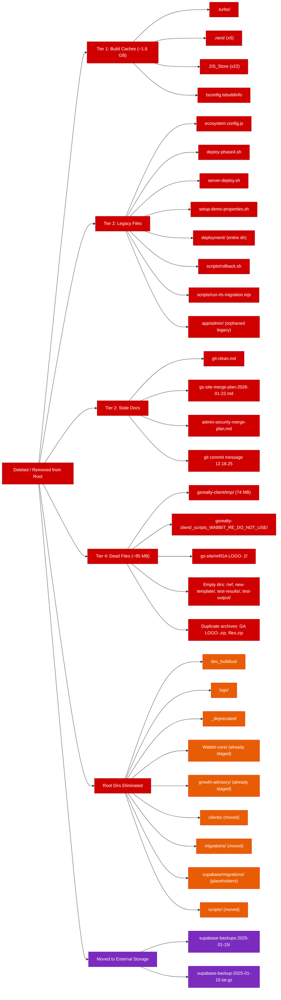
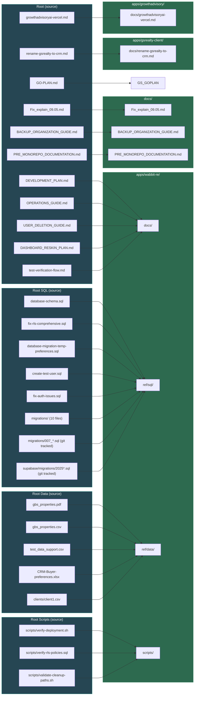

# Post-Cleanup Monorepo Structure

> Expected state after completing all steps (0-18) in `02.13.26cleantime.md`

---

## Full Monorepo Tree

```mermaid
graph TB
    ROOT["sullivan_realestate/Actual/"]

    %% ─── ROOT DIRECTORIES ───
    ROOT --> APPS["apps/"]
    ROOT --> PACKAGES["packages/"]
    ROOT --> DOCS["docs/"]
    ROOT --> GITHUB[".github/"]
    ROOT --> HUSKY[".husky/"]
    ROOT --> GIT[".git/"]
    ROOT --> NODEMOD["node_modules/ (gitignored)"]
    ROOT --> VERCELDIR[".vercel/ (gitignored)"]
    ROOT --> CLAUDEDIR[".claude/ (gitignored)"]

    %% ─── ROOT CONFIG FILES ───
    ROOT --> CFG["Root Configs"]
    CFG --> PJ["package.json"]
    CFG --> PLJ["package-lock.json"]
    CFG --> TJ["turbo.json"]
    CFG --> GI[".gitignore"]
    CFG --> VI[".vercelignore"]
    CFG --> ESL[".eslintrc.json"]
    CFG --> VJ["vercel.json"]
    CFG --> VGJ["vercel.gsrealty.json"]
    CFG --> VPJ["vercel.pro.json"]
    CFG --> ENV[".env.sample"]

    %% ─── ROOT DOCS ───
    ROOT --> RDOCS["Root Docs (6)"]
    RDOCS --> README["README.md"]
    RDOCS --> CLAUDE["CLAUDE.md (rewritten)"]
    RDOCS --> CONTRIB["CONTRIBUTING.md"]
    RDOCS --> MPT["MIGRATION_PROGRESS_TRACKER.md"]
    RDOCS --> MSP["MIGRATION_SAFETY_PROTOCOLS.md"]
    RDOCS --> LC["load-cap.md"]

    %% ─── APPS ───
    APPS --> GS["gs-site/<br/><i>pickleballisapsyop.com :3003</i>"]
    APPS --> GSR["gsrealty-client/<br/><i>CRM Platform :3004</i>"]
    APPS --> WRE["wabbit-re/<br/><i>wabbit-rank.ai :3000</i>"]
    APPS --> GA["growthadvisory/<br/><i>growthadvisory.ai :3005</i>"]
    APPS --> WAB["wabbit/<br/><i>Legacy Reference</i>"]

    %% ─── GS-SITE ───
    GS --> GS_APP["app/ (admin, api, crm, jarvis...)"]
    GS --> GS_COMP["components/ (53 tiles + UI)"]
    GS --> GS_LIB["lib/ (lifx, notion, github, budget...)"]
    GS --> GS_HOOKS["hooks/"]
    GS --> GS_TILES["tiles/"]
    GS --> GS_DOCS["docs/ (8 phase/integration specs)"]
    GS --> GS_REF["ref/ (logos, screenshots)"]
    GS --> GS_MIG["migrations/"]
    GS --> GS_PUB["public/"]

    %% ─── GSREALTY-CLIENT ───
    GSR --> GSR_APP["app/ (admin, client, form, rank-feed...)"]
    GSR --> GSR_COMP["components/ (glassmorphism UI)"]
    GSR --> GSR_LIB["lib/ (scraping, pipeline, database...)"]
    GSR --> GSR_HOOKS["hooks/"]
    GSR --> GSR_CTX["contexts/"]
    GSR --> GSR_DOCS["docs/<br/><i>NEW: rename-gsrealty-to-crm.md</i>"]
    GSR --> GSR_REF["ref/ (CRM screenshots)"]
    GSR --> GSR_TESTS["tests/ (Playwright e2e)"]
    GSR --> GSR_PUB["public/"]

    %% ─── WABBIT-RE ───
    WRE --> WRE_APP["app/ (form, rank-feed, setup, api...)"]
    WRE --> WRE_COMP["components/"]
    WRE --> WRE_LIB["lib/ (database, scraping, supabase...)"]
    WRE --> WRE_HOOKS["hooks/"]
    WRE --> WRE_CTX["contexts/"]
    WRE --> WRE_DOCS["docs/<br/><i>+6 moved docs</i>"]
    WRE --> WRE_REF["ref/<br/><i>NEW directory</i>"]
    WRE --> WRE_MIG["migrations/"]
    WRE --> WRE_SCRIPTS["scripts/<br/><i>+verify-deployment.sh</i>"]
    WRE --> WRE_PUB["public/"]

    %% ─── WABBIT-RE REF (new) ───
    WRE_REF --> WRE_SQL["ref/sql/<br/><i>All SQL + migration files</i>"]
    WRE_REF --> WRE_DATA["ref/data/<br/><i>CSVs, PDFs, XLSX, client data</i>"]

    %% ─── WABBIT-RE DOCS (expanded) ───
    WRE_DOCS --> WRE_DOCS_EX["auth/, fixes/, setup/<br/>+ DEVELOPMENT_PLAN.md<br/>+ OPERATIONS_GUIDE.md<br/>+ USER_DELETION_GUIDE.md<br/>+ DASHBOARD_RESKIN_PLAN.md<br/>+ test-verification-flow.md"]

    %% GO-PLAN.md moved to gs-site, not wabbit-re
    GS_DOCS --> GS_GOPLAN["GO-PLAN.md (moved from root)"]

    %% ─── GROWTHADVISORY ───
    GA --> GA_APP["app/ (privacy, referral-wall, resources, services)"]
    GA --> GA_COMP["components/ (marketing)"]
    GA --> GA_LIB["lib/"]
    GA --> GA_DOCS["docs/<br/><i>NEW: growthadvisoryai-vercel.md</i>"]
    GA --> GA_ASSETS["assets/ (branding)"]
    GA --> GA_PUB["public/"]

    %% ─── WABBIT (legacy) ───
    WAB --> WAB_REF["ref/ (diagrams, docs, core)"]

    %% ─── PACKAGES ───
    PACKAGES --> PKG_AUTH["auth/<br/><i>AuthContext.tsx</i>"]
    PACKAGES --> PKG_SUPA["supabase/<br/><i>client, server, middleware, types</i>"]
    PACKAGES --> PKG_UI["ui/<br/><i>Shared UI components</i>"]
    PACKAGES --> PKG_UTILS["utils/<br/><i>Shared utilities</i>"]

    %% ─── DOCS (shared) ───
    DOCS --> DOCS_CORE["Core Docs"]
    DOCS --> DOCS_DEPLOY["deployment/ (8 files)"]
    DOCS --> DOCS_SUPA["supabase/ (4 files)"]

    DOCS_CORE --> D_ARCH["ARCHITECTURE.md"]
    DOCS_CORE --> D_DB["DATABASE_OWNERSHIP.md"]
    DOCS_CORE --> D_SAFE["SAFETY_PROTOCOLS.md"]
    DOCS_CORE --> D_ESC["ESCAPE_HATCHES.md"]
    DOCS_CORE --> D_RUN["RUNBOOK.md"]
    DOCS_CORE --> D_CROSS["CROSS_APP_API.md"]
    DOCS_CORE --> D_OC1["OPENCLAW_IMPLEMENTATION_PLAN.md"]
    DOCS_CORE --> D_OC2["OPENCLAW_WABBIT_ARCHITECTURE.md"]
    DOCS_CORE --> D_FIX["Fix_explain_09.05.md (moved from root)"]
    DOCS_CORE --> D_BACKUP["BACKUP_ORGANIZATION_GUIDE.md (moved from root)"]
    DOCS_CORE --> D_PRE["PRE_MONOREPO_DOCUMENTATION.md (moved from root)"]

    %% ─── GITHUB ───
    GITHUB --> GH_WF["workflows/"]
    GH_WF --> GH_PROD["deploy-production.yml"]
    GH_WF --> GH_STAGE["deploy-staging.yml"]
    GH_WF --> GH_TEST["test.yml"]

    %% ─── STYLING ───
    classDef newDir fill:#2d6a4f,stroke:#40916c,color:#fff
    classDef movedFile fill:#1d3557,stroke:#457b9d,color:#fff
    classDef app fill:#6a040f,stroke:#9d0208,color:#fff
    classDef pkg fill:#5a189a,stroke:#7b2cbf,color:#fff
    classDef config fill:#495057,stroke:#6c757d,color:#fff
    classDef root fill:#212529,stroke:#495057,color:#fff

    class ROOT root
    class GS,GSR,WRE,GA,WAB app
    class PKG_AUTH,PKG_SUPA,PKG_UI,PKG_UTILS pkg
    class CFG,PJ,PLJ,TJ,GI,VI,ESL,VJ,VGJ,VPJ,ENV config
    class WRE_REF,WRE_SQL,WRE_DATA,GSR_DOCS,GA_DOCS newDir
    class D_FIX,D_BACKUP,D_PRE,WRE_DOCS_EX movedFile
```

---

## What Was Removed

---

## File Move Map

---

## Stats Summary

| Metric | Before | After |
|--------|--------|-------|
| Root directories | ~20+ | 9 |
| Root loose files | ~40+ | ~20 (6 docs + 14 configs) |
| Disk recovered | — | ~1.7 GB |
| Root `/scripts/` | 6+ files | eliminated |
| Root `/migrations/` | 10 files | eliminated |
| Root SQL files | 5 files | eliminated |
| Root planning docs | 15+ | 0 (all moved/deleted) |
| `apps/wabbit-re/ref/` | did not exist | `sql/` (15+ files) + `data/` (5+ files) |
