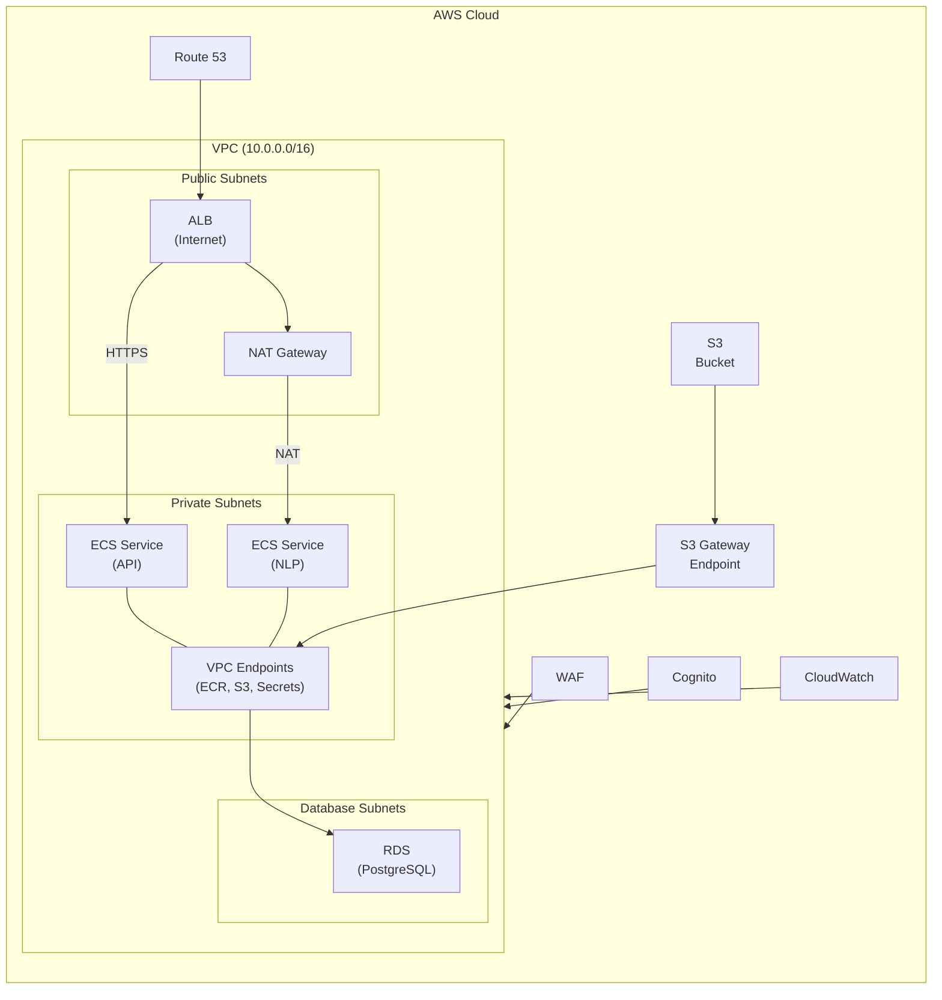

# AWS Cloud Infrastructure Diagram (Markdown)

## Mermaid (renderable)



## ASCII (plain text)

```text
+----------------------------------------------------------------------------------+
|                                   AWS Cloud                                      |
|                                                                                  |
|    [Route 53]          [WAF]              [Cognito]                 [CloudWatch] |
|        |                |                   |                          |         |
|        |                v                   v                          v         |
|        |         +--------------------------------------------------------------+ |
|        |         |                      VPC (10.0.0.0/16)                       | |
|        |         |                                                              | |
|        |         |   +-------------------------+     +------------------------+ | |
|        |         |   |     Public Subnets      |     |     Private Subnets    | | |
|        |         |   |                         |     |                        | | |
|        +-------->|   |  +-------------------+  |HTTPS|  +-------------------+ | | |
|                  |   |  | ALB (Internet)    |---------------->| ECS Service (API)| | |
|                  |   |  +-------------------+  |     |  +-------------------+ | | |
|                  |   |           |             |     |                        | | |
|                  |   |           v             | NAT |  +-------------------+ | | |
|                  |   |    +--------------+     +----->|  ECS Service (NLP)  | | | |
|                  |   |    | NAT Gateway  |-----------/ +-------------------+ | | |
|                  |   |    +--------------+             |         |           | | |
|                  |   +-------------------------+       |         |           | | |
|                  |                                      |  +----------------+ | | |
|                  |                                      |  | VPC Endpoints  | | | |
|                  |                                      |  | (ECR,S3,Secrets)| | | |
|                  |                                      |  +----------------+ | | |
|                  |                                      |         |           | | |
|                  |         +------------------------------------------------+ | | |
|                  |         |                 Database Subnets               | | | |
|                  |         |                                                | | | |
|                  |         |               +------------------+             | | | |
|                  |         |               | RDS (PostgreSQL)  |<------------+ | | |
|                  |         |               +------------------+             | | | |
|                  |         +------------------------------------------------+ | | |
|                  +--------------------------------------------------------------+ |
|                                                                                  |
|   [S3 Bucket] ---> [S3 Gateway Endpoint] ---> (to VPC Endpoints)                  |
+----------------------------------------------------------------------------------+
```
